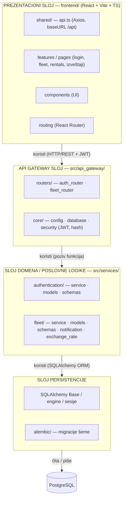
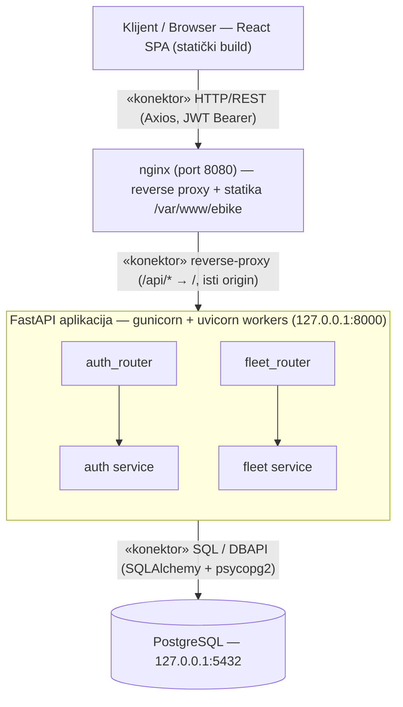
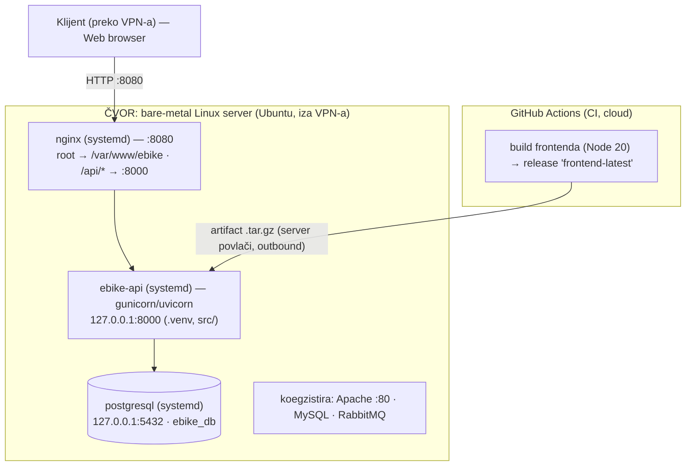

# Softverska arhitektura — eBike Fleet Management

Sistem za upravljanje flotom električnih bicikala: React (Vite/TypeScript) SPA,
FastAPI (Python) backend organizovan kao **modularni monolit** sa API Gateway-em,
PostgreSQL baza, JWT autentikacija. Deploy: nginx + gunicorn/uvicorn + systemd na
bare-metal Linux serveru; frontend se gradi u CI-ju (GitHub Actions).

U skladu sa SEI klasifikacijom (Bass, Clements, Kazman — *Documenting Software
Architectures*) prikazana su tri tipa struktura: **moduli**, **komponente i
konektori (C&C)** i **alokacije**.

---

## 1. Modulna struktura (Module view) — dekompozicija + slojevi

Statička struktura koda: jedinice implementacije (moduli/paketi) i relacija
*„koristi"* / *„deo je"*. Sistem je **slojevit (layered)**; svaki domen u
`services/` prati isti šablon `service` + `models` + `schemas`.

```
┌─────────────────────────────────────────────────────────────────────┐
│  PREZENTACIONI SLOJ  (frontend/ — React + Vite + TS)                 │
│   ├─ shared/        (api.ts: Axios instanca, baseURL "/api")         │
│   ├─ features/pages (ekrani: login, fleet, rentals, izveštaji…)      │
│   ├─ components      (UI komponente)                                  │
│   └─ routing         (React Router)                                   │
└───────────────────────────────┬─────────────────────────────────────┘
                                 │ koristi (HTTP/REST + JWT)
┌───────────────────────────────▼─────────────────────────────────────┐
│  API GATEWAY SLOJ  (src/api_gateway/)                                │
│   ├─ routers/  auth_router.py      fleet_router.py                    │
│   └─ core/     config.py   database.py   security.py (JWT, hash)      │
└───────────────────────────────┬─────────────────────────────────────┘
                                 │ koristi (poziv funkcija)
┌───────────────────────────────▼─────────────────────────────────────┐
│  SLOJ DOMENA / POSLOVNE LOGIKE  (src/services/)                      │
│   ├─ authentication/  service · models · schemas                     │
│   └─ fleet/           service · models · schemas                     │
│                       notification_service · exchange_rate_service   │
└───────────────────────────────┬─────────────────────────────────────┘
                                 │ koristi (SQLAlchemy ORM)
┌───────────────────────────────▼─────────────────────────────────────┐
│  SLOJ PERSISTENCIJE                                                  │
│   ├─ SQLAlchemy Base / engine / sesije                               │
│   └─ alembic/  (verzionisane migracije šeme baze)                    │
└───────────────────────────────┬─────────────────────────────────────┘
                                 │ čita/piše
                          ┌──────▼──────┐
                          │ PostgreSQL  │
                          └─────────────┘
```



**Elementi (moduli) i odgovornosti**

| Modul | Odgovornost |
|------|-------------|
| `frontend/shared` | Axios klijent, presretači, tipovi |
| `api_gateway/routers` | Definicija REST ruta (`/auth`, `/fleet`), validacija ulaza |
| `api_gateway/core` | Konfiguracija (Pydantic Settings), DB sesija, sigurnost (JWT/hash) |
| `services/authentication` | Korisnici, profili, role, refresh tokeni |
| `services/fleet` | Bicikli, baterije, iznajmljivanja, održavanje, finansije, valute/kursevi |
| `alembic` | Migracije baze (10 revizija) |

**Relacije:** slojevi se oslanjaju nadole (prezentacija → gateway → domen →
persistencija → baza). Domeni `authentication` i `fleet` su međusobno nezavisni
(niska sprega), spaja ih tek API Gateway — pripremljeno za eventualno izdvajanje
u mikroservise.

---

## 2. Struktura komponente–konektori (C&C view) — runtime

Dinamička struktura: komponente koje *postoje u vreme izvršavanja* i konektori
preko kojih komuniciraju.

```
   [ Klijent / Browser ]
   React SPA (statički build)
            │
            │  «konektor» HTTP/REST  (Axios, JWT Bearer u Authorization)
            ▼
   ┌───────────────────────┐
   │   nginx  (port 8080)  │   ── služi statički SPA (/var/www/ebike)
   │   reverse proxy       │
   └───────┬───────────────┘
           │  «konektor» reverse-proxy  ( /api/* → /  , isti origin )
           ▼
   ┌───────────────────────────────────────┐
   │  FastAPI aplikacija                    │
   │  gunicorn + uvicorn workers            │   127.0.0.1:8000
   │  ┌──────────────┐   ┌───────────────┐  │
   │  │ auth_router  │   │ fleet_router  │  │  «konektor» poziv procedure
   │  └──────┬───────┘   └──────┬────────┘  │
   │  ┌──────▼───────┐   ┌──────▼────────┐  │
   │  │ auth service │   │ fleet service │  │
   │  └──────┬───────┘   └──────┬────────┘  │
   └─────────┼──────────────────┼───────────┘
             │  «konektor» SQL / DBAPI (SQLAlchemy + psycopg2)
             ▼
      ┌────────────┐
      │ PostgreSQL │  127.0.0.1:5432
      └────────────┘
```



**Komponente (runtime):** SPA u browseru · nginx proces · FastAPI proces
(gunicorn master + uvicorn workeri) · PostgreSQL server.

**Konektori:**
- **HTTP/REST + JWT** — browser ↔ nginx (request/response).
- **Reverse-proxy** — nginx ↔ FastAPI; nginx skida `/api` prefiks (isti origin,
  bez CORS-a).
- **Poziv procedure** — router → servis → ORM (sinhroni in-process poziv).
- **SQL/DBAPI** — servisni sloj ↔ PostgreSQL (psycopg2).

**Tok autentikacije:** login → access JWT (u memoriji klijenta) + refresh token
(httpOnly cookie); `/auth/refresh` rotira token. Role `admin`/`driver` kontrolišu
pristup (`require_admin`).

---

## 3. Alokaciona struktura (Allocation view) — deployment

Mapiranje softvera na okruženje izvršavanja (čvorovi, procesi, CI).

```
        ┌─────────────────────────┐         ┌──────────────────────────────┐
        │  Klijent (preko VPN-a)  │         │  GitHub Actions (CI, cloud)  │
        │  Web browser            │         │  build frontenda (Node 20)   │
        └───────────┬─────────────┘         │  → release „frontend-latest" │
                    │ HTTP :8080            └───────────────┬──────────────┘
                    │                                        │ artifact (.tar.gz)
                    │                                        │ (server povlači, outbound)
   ═════════════════▼════════════════════════════════════════▼═══════════════
   ║  ČVOR: bare-metal Linux server (Ubuntu, iza VPN-a)                      ║
   ║                                                                         ║
   ║   ┌── nginx (systemd) ─────────── :8080 ──────────────────────────┐    ║
   ║   │     root → /var/www/ebike  (SPA)                              │    ║
   ║   │     /api/* → 127.0.0.1:8000                                   │    ║
   ║   └───────────────────────────────────────────────────────────────┘    ║
   ║   ┌── ebike-api (systemd) ── gunicorn/uvicorn ── 127.0.0.1:8000 ──┐    ║
   ║   │     /home/<user>/…/ebike_fleet_app  (.venv, src/)             │    ║
   ║   └───────────────────────────────────────────────────────────────┘    ║
   ║   ┌── postgresql (systemd) ───────────────────── 127.0.0.1:5432 ──┐    ║
   ║   │     baza: ebike_db   uloga: ebike                             │    ║
   ║   └───────────────────────────────────────────────────────────────┘    ║
   ║   (koegzistira sa postojećim Apache na :80, MySQL, RabbitMQ)            ║
   ═════════════════════════════════════════════════════════════════════════
```



**Alokacija (deployment):** sve tri runtime komponente su na jednom čvoru, ali su
izolovane — samo nginx je javno izložen (jedan port), backend i baza slušaju samo
`localhost`. **Implementaciona alokacija:** izvorni kod u Git repozitorijumu;
build frontenda kao CI artefakt (server ga povlači jer je iza VPN-a i nema
inbound, samo outbound). **Raspodela posla:** frontend i dva domena (auth, fleet)
su zasebne celine koje se mogu razvijati nezavisno.

---

## Odgovori na pitanja

### 1) Koje gotove komponente ste koristili i kako su smanjile vreme razvoja?

Korišćen je veliki broj proverenih, gotovih (off-the-shelf) komponenti — umesto
pisanja od nule, dobili smo rešene česte probleme:

**Backend**
- **FastAPI** — rutiranje, validacija, automatska OpenAPI/Swagger dokumentacija.
- **Pydantic / pydantic-settings** — deklarativna validacija i serijalizacija
  zahteva/odgovora i učitavanje konfiguracije iz okruženja.
- **SQLAlchemy (ORM)** — rad sa bazom kroz objekte umesto ručnog SQL-a.
- **Alembic** — verzionisanje i automatske migracije šeme baze.
- **python-jose** — generisanje i verifikacija JWT tokena.
- **gunicorn + uvicorn** — produkcioni ASGI server (workeri, restart).
- **PostgreSQL** — gotov, pouzdan RDBMS (transakcije, integritet).

**Frontend**
- **React + Vite + TypeScript** — komponentni UI + brz build i HMR + tipovi.
- **React Router** — klijentsko rutiranje (SPA).
- **TanStack Query** — keširanje server-state-a, fetch/refetch, sinhronizacija.
- **Axios** — HTTP klijent sa presretačima (npr. dodavanje JWT-a).
- **Zod** — validacija podataka na klijentu.
- **TailwindCSS** — brzo stilizovanje bez pisanja CSS-a od nule.
- **jsPDF + html2canvas** — generisanje PDF izveštaja u browseru.

**Infrastruktura**
- **nginx** — posluživanje statike + reverse proxy.
- **GitHub Actions** — CI: automatski build i objavljivanje artefakta.

**Efekat:** procene, validacija, autentikacija, ORM, migracije, build i posluživanje
— sve su gotove komponente, čime je razvoj sveden na poslovnu logiku domena
(bicikli, iznajmljivanja, finansije), a ne na infrastrukturu.

### 2) Da li ste koristili višestruko upotrebljiv model arhitekture (familije softverskih proizvoda)?

Da — korišćeno je više **standardnih, višestruko upotrebljivih arhitektonskih
modela/šablona**:

- **Slojevita arhitektura (Layered)** — prezentacija / API / domen / persistencija.
- **Klijent–server + REST** (SPA + API), tj. klasična **troslojna (3-tier)** podela.
- **API Gateway** kao jedinstvena ulazna tačka ka domenima.
- **Service / Repository šablon** po domenu.

Najvažnije: unutar projekta postoji **interni višestruko upotrebljiv šablon
modula** — svaki domen (`authentication`, `fleet`) ima istu strukturu
`service` + `models` + `schemas` + `router`. To je oblik **reuse-a na nivou
familije internih modula**: svaki novi domen se dodaje po istom „receptu". Sistem
je **modularni monolit struktuiran kao mikroservisi**, što je prepoznatljiv,
ponovljiv referentni model za web aplikacije ovog tipa.

### 3) Da li postoje specifičnosti u odnosu na standardni model?

Da, nekoliko:

- **Modularni monolit „spreman za mikroservise"** — domeni su razdvojeni i nezavisni
  (niska sprega), pa se `fleet`/`authentication` mogu izdvojiti bez velikih izmena.
- **Build u CI-ju + povlačenje artefakta** — pošto je server iza **VPN-a** i nema
  inbound (a lokalno nema novog Node-a), frontend se gradi u GitHub Actions i objavi
  kao *release artifact* koji server **povlači** (samo outbound). CI nikad ne pristupa
  serveru — netipično u odnosu na standardni „CI deploya preko SSH" model.
- **Jedan javni port na deljenom serveru** — nginx koegzistira sa postojećim Apache
  na :80; aplikacija je na slobodnom portu (:8080), a SPA koristi relativni `/api`
  pa je nezavisna od porta.
- **Bezbednosna specifičnost** — access JWT u memoriji + **refresh token u httpOnly
  cookie-ju sa rotacijom**, role-based pristup; **prvi registrovani korisnik
  automatski postaje admin** (bootstrap mehanizam).
- **Domenske specifičnosti** — servisi za **notifikacije** i **kurseve valuta**
  (`exchange_rate_service`) integrišu spoljne/izračunate podatke u poslovnu logiku.
